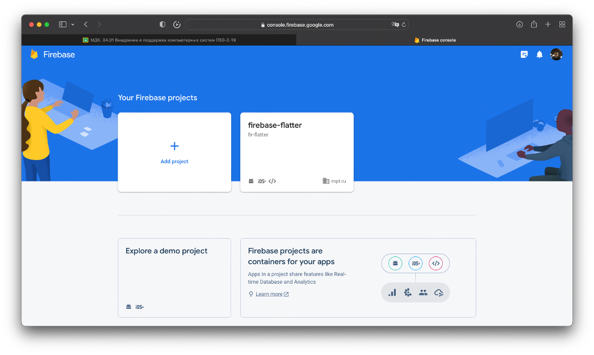
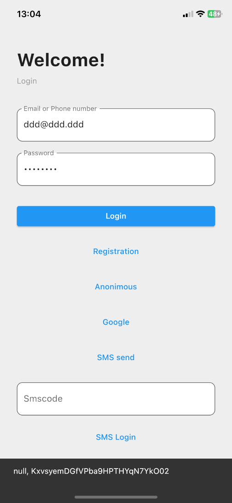
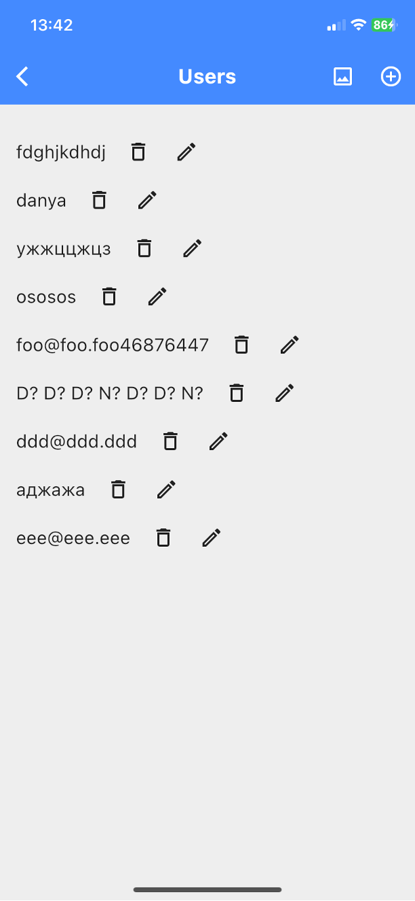
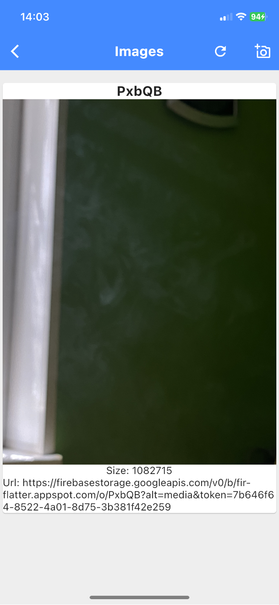
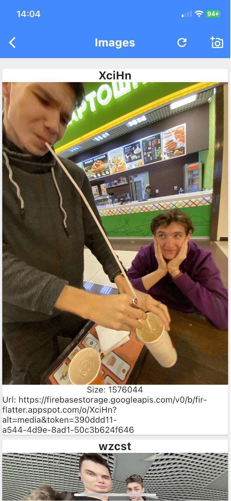

# ПРАКТИЧЕСКАЯ РАБОТА №8,9,10

FirebaseAuth, FireStore, Firebase Storage, FilePicker

## Цель работы: 

реализовать аутентификацию при помощи firebaseauth по почте и логину, анонимного пользователя, с помощью Google и через SMS код, реализовать регистрацию с сохранением логина пользователя в firestore, и страницы для CRUD действий с этими данными и их динамическим обновлением, а также Необходимо реализовать функционал для загрузки и удаления картинок в Firebase Storage, а также отображения списка всех картинок, находящихся в Firebase Storage. В списке должны быть следующие атрибуты: название картинки, сама картинка, размер и ссылка на картинку, связать Cloud Firestore с Firebase Storage. В firestore хранить все данные картинки, связать Cloud Firestore с Firebase Storage и firebaseauth. Реализовать авторизацию и регистрацию. У пользователя есть свои реальные картинки, которые он может выводить, удалять и изменять. Все данные хранятся в Cloud Firestore, а сама картинка хранится в Firebase Storage.

Для начала требуется зайти на сайт Firebase, зарегистрироваться там и создать проект следуя всем шагам, и там будут предложенные команды, которые просто требуется скопировать и выполнить в терминале проекта.



После успешного создания проекта необходимо перейти к созданию авторизации. 

Также в проекте требуются следующие зависимости, прописанные в pabspec.yaml: 

•	firebase_core: ^2.6.1

•	firebase_auth: ^4.2.8

•	firebase_dynamic_links: ^5.0.15

•	google_sign_in: ^5.2.1

•	cloud_firestore: ^4.4.4

•	file_picker: ^5.2.6

•	firebase_storage: ^11.0.16

Для начала необходимой создать страницу, на которой будут находится поля для логина и пароля, а также кнопки, отвечающие за разные типы авторизации.

Поля ввода логина и пароля и кнопка обычной авторизации по логину и паролю.

``` dart 
Form(
                  key: _formKey,
                  child: Column(
                    children: [
                      TextFormField(
                        controller: _emailController,
                        decoration: InputDecoration(
                          filled: true,
                          fillColor: Colors.white,
                          labelText: 'Email or Phone number',
                          border: OutlineInputBorder(
                            borderRadius: BorderRadius.circular(10.0),
                          ),
                        ),
                        validator: (value) {
                          if (value!.isEmpty) {
                            return 'Please enter your email';
                          }
                          return null;
                        },
                      ),

                      const SizedBox(height: 20.0),
                      TextFormField(
                        controller: _passwordController,
                        decoration: InputDecoration(
                          filled: true,
                          fillColor: Colors.white,
                          labelText: 'Password',
                          border: OutlineInputBorder(
                            borderRadius: BorderRadius.circular(10.0),
                          ),
                        ),
                        obscureText: true,
                      ),

                      const SizedBox(height: 30.0),
                      SizedBox(
                        width: double.infinity,
                        child: ElevatedButton(
                          onPressed: () {
                            if (_formKey.currentState!.validate()) {
                              FirebaseAuth.instance
                                  .signInWithEmailAndPassword(
                                      email: _emailController.text,
                                      password: _passwordController.text)
                                  .then((value) {
                                ScaffoldMessenger.of(context)
                                    .showSnackBar(SnackBar(
                                  content: Text(
                                    "${value.user?.email}, ${value.user?.uid}",
                                  ),
                                ));
                                Navigator.pushNamed(
                                    context, MainPage.routeName);
                              });
                            }
                          },
                          child: const Text('Login'),
                        ),
                      ),
                    ],
                  ),
                ),
```

Здесь используется такой метод как signInWithEmailAndPassword, в который передается 2 значения: логин и пароль, после чего в зависимости от успешности авторизации в SnackBar выводится идентификационный номер пользователя и его логин и осуществляется переход на другую страничку в приложении.

Следующей функцией была реализована авторизация анонимным пользователем.

``` dart
const SizedBox(height: 15.0),
                Center(
                  child: TextButton(
                    onPressed: () {
                      FirebaseAuth.instance.signInAnonymously().then((value) {
                        ScaffoldMessenger.of(context).showSnackBar(SnackBar(
                          content: Text(
                            "${value.user?.email}, ${value.user?.uid}",
                          ),
                        ));
                      });
                    },
                    child: const Text('Anonimous'),
                  ),
                ),
```

В данном случае вызывается метод signInAnonymously, который в себя ничего не принимает. После успешной авторизации в SnackBar выводится ег логин, который имеет значение null по умолчанию, и идентификационный номер пользователя.

Далее была реализована функция авторизации через сторонний сервис, в нашем случае Google.

``` dart
const SizedBox(height: 15.0),
                Center(
                  child: TextButton(
                    onPressed: () async {
                      try {
                        signInWithGoogle().then((value) => {
                              ScaffoldMessenger.of(context)
                                  .showSnackBar(SnackBar(
                                content: Text(
                                  "${FirebaseAuth.instance.currentUser!.uid}, ${FirebaseAuth.instance.currentUser!.email}",
                                ),
                              )),
                              Navigator.pushNamed(context, MainPage.routeName)
                            });
                        UserCredential userCredential =
                            await signInWithGoogle();
                        User user = userCredential.user!;
                      } on FirebaseAuthException catch (e) {
                        print(e);
                      }
                    },
                    child: const Text('Google'),
                  ),
                ),
```

В данном случае вызывается метод signInWithGoogle, который прописан в коде в самом низу, и в зависимости от результата авторизации в SnackBar выводится все та же информация что и ранее, и осуществляется переход на другую страницу.

``` dart
  Future<UserCredential> signInWithGoogle() async {
    final GoogleSignInAccount? googleSignInAccount =
        await googleSignIn.signIn();
    final GoogleSignInAuthentication googleSignInAuthentication =
        await googleSignInAccount!.authentication;
    final AuthCredential credential = GoogleAuthProvider.credential(
      accessToken: googleSignInAuthentication.accessToken,
      idToken: googleSignInAuthentication.idToken,
    );
    return await _auth.signInWithCredential(credential);
  }
```

И последней функцией была реализована авторизация через SMS код, при нажатии на 1 кнопку на вписанный номер телефона в поле логина в формате: +79999999999 отправляется SMS код, который требуется вписать в рассчитанное под то поле, и после чего следует нажать 2-ую кнопку.

``` dart
const SizedBox(height: 15.0),
                Center(
                  child: TextButton(
                    onPressed: () async {
                      try {
                        await FirebaseAuth.instance.verifyPhoneNumber(
                          phoneNumber: _emailController.text,
                          codeSent:
                              (String verificationId, int? resendToken) async {
                            verificationId1 = verificationId;
                            resendToken1 = resendToken;
                            var showSnackBar = ScaffoldMessenger.of(context)
                                .showSnackBar(const SnackBar(
                              content: Text(
                                "SMS отправленo",
                              ),
                            ));
                          },
                          codeAutoRetrievalTimeout: (String verificationId) {},
                          verificationCompleted:
                              (PhoneAuthCredential phoneAuthCredential) {},
                          verificationFailed: (FirebaseAuthException error) {},
                        );
                      } on FirebaseAuthException catch (e) {
                        print(e);
                      }
                    },
                    child: const Text('SMS send'),
                  ),
                ),

                const SizedBox(height: 20.0),
                TextFormField(
                  controller: _smscodeController,
                  decoration: InputDecoration(
                    filled: true,
                    fillColor: Colors.white,
                    labelText: 'Smscode',
                    border: OutlineInputBorder(
                      borderRadius: BorderRadius.circular(10.0),
                    ),
                  ),
                ),

                const SizedBox(height: 15.0),
                Center(
                  child: TextButton(
                    onPressed: () async {
                      try {
                        String smsCode = _smscodeController.text;
                        PhoneAuthCredential credentiall =
                            PhoneAuthProvider.credential(
                                verificationId: verificationId1,
                                smsCode: smsCode);
                        await FirebaseAuth.instance
                            .signInWithCredential(credentiall);
                        ScaffoldMessenger.of(context).showSnackBar(SnackBar(
                          content: Text(
                            "${FirebaseAuth.instance.currentUser!.uid}, ${FirebaseAuth.instance.currentUser!.phoneNumber}",
                          ),
                        ));
                      } on FirebaseAuthException catch (e) {
                        print(e);
                      }
                    },
                    child: const Text('SMS Login'),
                  ),
                ),
```

Результат:




После реализации авторизации нужно реализовать регистрацию, при которой по мимо добавления его данных в FirebaseAuth, его логин добавляется в FireStore.

``` dart
const Text(
                  'Welcome!',
                  style: TextStyle(fontSize: 32.0, fontWeight: FontWeight.bold),
                ),
                const SizedBox(height: 10.0),
                const Text(
                  'Registration',
                  style: TextStyle(color: Colors.grey),
                ),
                const SizedBox(height: 40.0),
                TextFormField(
                  controller: _emailController,
                  decoration: InputDecoration(
                    filled: true,
                    fillColor: Colors.white,
                    labelText: 'Email or Phone number',
                    border: OutlineInputBorder(
                      borderRadius: BorderRadius.circular(10.0),
                    ),
                  ),
                  validator: (value) {
                    if (value!.isEmpty) {
                      return 'Please enter your email';
                    }
                    return null;
                  },
                ),
                const SizedBox(height: 20.0),
                TextFormField(
                  controller: _passwordController,
                  decoration: InputDecoration(
                    filled: true,
                    fillColor: Colors.white,
                    labelText: 'Password',
                    border: OutlineInputBorder(
                      borderRadius: BorderRadius.circular(10.0),
                    ),
                  ),
                  obscureText: true,
                ),
                const SizedBox(height: 15.0),
                Center(
                  child: TextButton(
                    onPressed: () async {
                      try {
                        UserCredential userCredential =
                            await _auth.createUserWithEmailAndPassword(
                          email: _emailController.text,
                          password: _passwordController.text,
                        );
                        await fireStore
                            .collection('user')
                            .doc(userCredential.user!.uid)
                            .set(
                              {'email': _emailController.text},
                            )
                            .then((value) => ScaffoldMessenger.of(context)
                                .showSnackBar(SnackBar(
                                    content: Text("Пользователь добавлен"))))
                            .catchError((error) => ScaffoldMessenger.of(context)
                                .showSnackBar(
                                    SnackBar(content: Text("Фэйл: $error"))));
                        Navigator.pop(context);
                      } on FirebaseAuthException catch (e) {
                        print(e);
                      }
                    },
                    child: const Text('Registration!'),
                  ),
                ),
```

Регистрация происходит с помощью метода createUserWithEmailAndPassword, в который передается логин и пароль пользователя, и логин записывается в коллекцию с названием user, в документ с идентификационным номером пользователем при помощи set.

Далее требуется создать страничку для вывода из FireStore коллекции User и для CRUD взаимодействия с этими данными. 

``` dart
child: StreamBuilder<QuerySnapshot>(
              stream: _usersStream,
              builder: (BuildContext context,
                  AsyncSnapshot<QuerySnapshot> snapshot) {
                if (snapshot.hasError) {
                  return const Text('Oops!!!');
                }
                if (snapshot.connectionState == ConnectionState.waiting) {
                  return const Text("WAIT");
                }
                return ListView(
                  padding: const EdgeInsets.all(8),
                  children: snapshot.data!.docs
                      .map((DocumentSnapshot document) {
                        Map<String, dynamic> data =
                            document.data() as Map<String, dynamic>;
                        return Row(
                          mainAxisAlignment: MainAxisAlignment.start,
                          children: <Widget>[
                            Padding(
                                padding: const EdgeInsets.all(8.0),
                                child: Text(
                                  data['email'],
                                  style: TextStyle(fontSize: 18.0),
                                )),
                            IconButton(
                              onPressed: () async {
                                final FirebaseFirestore fireStore =
                                    FirebaseFirestore.instance;
                                await fireStore
                                    .collection('user')
                                    .doc(document.id)
                                    .delete()
                                    .then((value) =>
                                        ScaffoldMessenger.of(context)
                                            .showSnackBar(SnackBar(
                                                content: Text("User Delete"))))
                                    .catchError((error) => ScaffoldMessenger.of(
                                            context)
                                        .showSnackBar(SnackBar(
                                            content: Text(
                                                "Cant delete user: $error"))));
                              },
                              icon: Icon(Icons.delete_outline),
                            ),
                            IconButton(
                              onPressed: () {
                                Navigator.pushNamed(
                                  context,
                                  EditUserPage.routeName,
                                  arguments: {
                                    'id': document.id,
                                    'email': data['email'],
                                  },
                                );
                              },
                              icon: Icon(Icons.mode_edit_outline_outlined),
                            ),
                          ],
                        );
                      })
                      .toList()
                      .cast(),
                );
              },
            ),
```

Данные выводятся при помощи StreamBuilder, который позволяет динамически обновлять данные каждый определенный промежуток при помощи snapshot. Также рядом с данными реализованы 2 кнопки добавление и удаление. Добавление и изменение данных реализовано через дополнительные страницы.

Добавление

``` dart
TextFormField(
                controller: _emailController,
                decoration: InputDecoration(
                  filled: true,
                  fillColor: Colors.white,
                  labelText: 'Email or Phone number',
                  border: OutlineInputBorder(
                    borderRadius: BorderRadius.circular(10.0),
                  ),
                ),
                validator: (value) {
                  if (value!.isEmpty) {
                    return 'Please enter your email';
                  }
                  return null;
                },
              ),
              const SizedBox(height: 15.0),
              Center(
                child: TextButton(
                  onPressed: () async {
                    final FirebaseFirestore fireStore =
                        FirebaseFirestore.instance;
                    final auth = FirebaseAuth.instance;
                    await fireStore
                        .collection('user')
                        .add(
                          {'email': _emailController.text},
                        )
                        .then((value) => ScaffoldMessenger.of(context)
                            .showSnackBar(
                                SnackBar(content: Text("User Added"))))
                        .catchError((error) => ScaffoldMessenger.of(context)
                            .showSnackBar(SnackBar(
                                content: Text("Failed to add user: $error"))));
                    Navigator.pop(context);
                  },
                  child: const Text('ADD!'),
                ),
              ),
```

Изменение

``` dart
TextFormField(
                controller: _emailController,
                decoration: InputDecoration(
                  filled: true,
                  fillColor: Colors.white,
                  labelText: 'Email or Phone number',
                  border: OutlineInputBorder(
                    borderRadius: BorderRadius.circular(10.0),
                  ),
                ),
                validator: (value) {
                  if (value!.isEmpty) {
                    return 'Please enter your email';
                  }
                  return null;
                },
              ),
              const SizedBox(height: 15.0),
              Center(
                child: TextButton(
                  onPressed: () async {
                    final FirebaseFirestore fireStore =
                        FirebaseFirestore.instance;
                    final auth = FirebaseAuth.instance;
                    await fireStore
                        .collection('user')
                        .doc(arguments['id'].toString())
                        .set(
                          {'email': _emailController.text},
                        )
                        .then((value) => ScaffoldMessenger.of(context)
                            .showSnackBar(
                                SnackBar(content: Text("User Update"))))
                        .catchError((error) => ScaffoldMessenger.of(context)
                            .showSnackBar(SnackBar(
                                content:
                                    Text("Failed to update user: $error"))));
                    Navigator.pop(context);
                  },
                  child: const Text('EDIT!'),
                ),
              ),
```

После этого нужно проверить работу приложения.




Далее необходимо реализовать функционал для загрузки и удаления картинок в Firebase Storage, а также отображения списка всех картинок, находящихся в Firebase Storage. В списке должны быть следующие атрибуты: название картинки, сама картинка, размер и ссылка на картинку, связать Cloud Firestore с Firebase Storage. В firestore хранить все данные картинки, связать Cloud Firestore с Firebase Storage и firebaseauth. Реализовать авторизацию и регистрацию. У пользователя есть свои реальные картинки, которые он может выводить, удалять и изменять. Все данные хранятся в Cloud Firestore, а сама картинка хранится в Firebase Storage. 
Для начала в Firebase console нужно подключить Firebase Storage.

Для взаимодействия с картинками необходимо создать новую страничку.

``` dart
class _ImagesPageState extends State<ImagesPage> {
  Future<void> _incrementCounter() async {
    final result = await FilePicker.platform.pickFiles(
      type: FileType.image,
      dialogTitle: 'Выбор файла',
    );

    if (result != null) {
      final size = result.files.first.size;
      final file = File(result.files.single.path!);
      final fileExtensions = result.files.first.extension!;
      final auth = FirebaseAuth.instance;

      ScaffoldMessenger.of(context).showSnackBar(SnackBar(
        content: Text(
          "размер:$size file:${file.path} fileExtensions:${fileExtensions}",
        ),
      ));
      String name = getRandomString(5);
      FirebaseStorage.instance.ref().child(name).putFile(file,
          SettableMetadata(customMetadata: {"User": auth.currentUser!.uid}));

      final FirebaseFirestore fireStore = FirebaseFirestore.instance;

      await fireStore
          .collection('images')
          .doc(name)
          .set(
            {
              'size': size,
              'path': file.toString(),
              'name': name,
            },
          )
          .then((value) => ScaffoldMessenger.of(context)
              .showSnackBar(SnackBar(content: Text("images info Added"))))
          .catchError((error) => ScaffoldMessenger.of(context).showSnackBar(
              SnackBar(content: Text("Failed to add images info: $error"))));
    } else {}
  }

```

При добалении картинки открывается filePicker, после выбора картинки ее данные записываются в fireStore, а сама картинка с идентификационным номером пользователя в кастомных метаданных записывается в FirebaseStorage, это сделанно для последующего вывода картинок пользователя ему же.

``` dart
  Future<void> initImage() async {
    fullpath.clear();
    final storageReference = FirebaseStorage.instance.ref().list();
    final list = await storageReference;
    final auth = FirebaseAuth.instance;

    list.items.forEach((element) async {
      final meta = await element.getMetadata();
      final customValue = meta.customMetadata!['User'];
      ScaffoldMessenger.of(context)
          .showSnackBar(SnackBar(content: Text("${customValue}")));
      if (customValue == auth.currentUser!.uid) {
        final url = await element.getDownloadURL();
        Uint8List? size = await element.getData();
        fullpath.add(ModelTest(url, element.name, size?.lengthInBytes));
      }

      setState(() {});
    });
  }
```

Данный метод отвечает за вывод картинок пользователю. Берутся данные каждого файла из FirebaseStorage по очереди, и сравнивается поле User из кастомных метаданных с авторизованным идентификационным номером пользователя, после чего все взятые данные о картинку (Название, размер и ссылка) передаются в модель.

``` dart
class ModelTest {
  String? url;
  String? name;
  int? size;

  ModelTest(this.url, this.name, this.size);
}
```

Далее в верстке находится List для вывода всех кртико и информации этих картинок.

``` dart
child: ListView.builder(
                  itemCount: fullpath.length,
                  itemBuilder: (context, index) {
                    return Card(
                      child: InkWell(
                        onLongPress: () async {
                          final FirebaseFirestore fireStore =
                              FirebaseFirestore.instance;
                          await fireStore
                              .collection('images')
                              .doc(fullpath[index].name!)
                              .delete()
                              .then((value) => ScaffoldMessenger.of(context)
                                  .showSnackBar(SnackBar(
                                      content: Text("Image info Delete"))))
                              .catchError((error) => ScaffoldMessenger.of(
                                      context)
                                  .showSnackBar(SnackBar(
                                      content: Text(
                                          "Cant delete image info: $error"))));
                          link = '';
                          await FirebaseStorage.instance
                              .ref("/" + fullpath[index].name!)
                              .delete();
                          await initImage();
                          setState(() {});
                        },
                        child: Column(
                          mainAxisAlignment: MainAxisAlignment.start,
                          children: [
                            Text(
                              "${fullpath[index].name!}",
                              style: TextStyle(
                                  fontSize: 20.0, fontWeight: FontWeight.bold),
                            ),
                            Image.network(
                              fullpath[index].url!,
                              fit: BoxFit.fitWidth,
                            ),
                            Text(
                              "Size: ${fullpath[index].size!}",
                              style: TextStyle(fontSize: 15.0),
                            ),
                            Text(
                              "Url: ${fullpath[index].url!}",
                              style: TextStyle(fontSize: 15.0),
                            ),
                          ],
                        ),
                      ),
                    );
                  }),
```

Удаление картинок реализовано через долгое зажатие картинки, также при удалении картинки удаляются ее данные из firestore.





Вывод: в ходе выполнения данной практической работы удалось реализовать аутентификацию при помощи FirebaseAuth по почте и логину, анонимного пользователя, с помощью Google и через SMS код, реализовать регистрацию с сохранением логина пользователя в firestore, и страницы для CRUD действий с этими данными и их динамическим обновлением, а также необходимо реализовать функционал для загрузки и удаления картинок в Firebase Storage, а также отображения списка всех картинок, находящихся в Firebase Storage. В списке должны быть следующие атрибуты: название картинки, сама картинка, размер и ссылка на картинку, связать Cloud Firestore с Firebase Storage. В firestore хранить все данные картинки, связать Cloud Firestore с Firebase Storage и firebaseauth. Реализовать авторизацию и регистрацию. У пользователя есть свои реальные картинки, которые он может выводить, удалять и изменять. Все данные хранятся в Cloud Firestore, а сама картинка хранится в Firebase Storage.